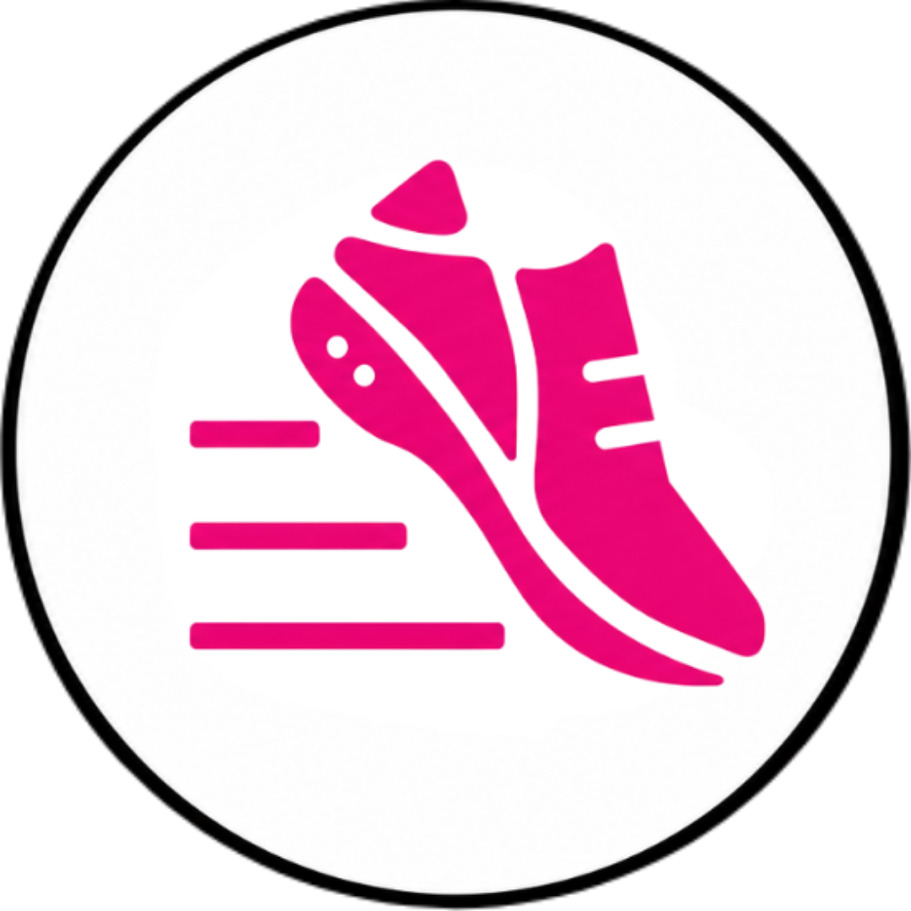

  

# Sue Heddle for Ward 5 — Campaign Site

Official campaign website for **Sue Heddle**, candidate for Ward 5 Councillor in Oakville's 2026 municipal election ([sueheddle.ca](https://sueheddle.ca)).

Built with Next.js and TypeScript, with donation processing, a volunteer/lawn-sign/vote signup flow, and a 13-language site.

## Features

- **Donations** — Stripe-powered checkout with an optional processing-fee cover and a live calculator for Oakville's 50% municipal contribution rebate.
- **Volunteer / lawn sign / vote pledge** — sign up to volunteer, request a lawn sign, or pledge your vote.
- **Newsletter** — stay updated on the campaign, unsubscribe anytime.
- **Multi-language** — English plus 12 languages (Arabic, Spanish, French, Hindi, Korean, Punjabi, Portuguese, Russian, Tagalog, Ukrainian, Urdu, Chinese), switchable from the nav.

## Tech stack

Next.js, TypeScript, Stripe, Framer Motion, GSAP.

See [`DESIGN.md`](./DESIGN.md) and [`COLORS_AND_FONTS.md`](./COLORS_AND_FONTS.md) for the visual design system.
